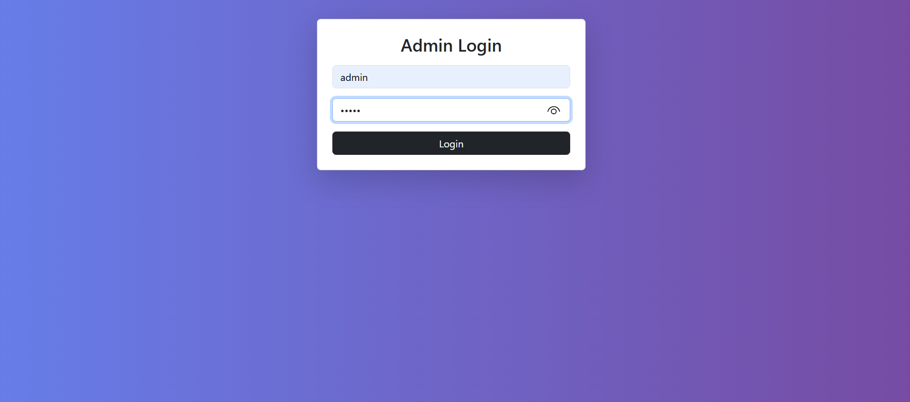
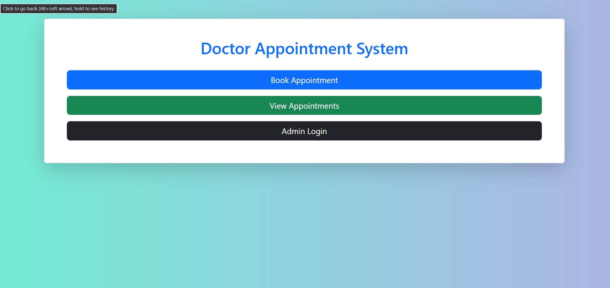
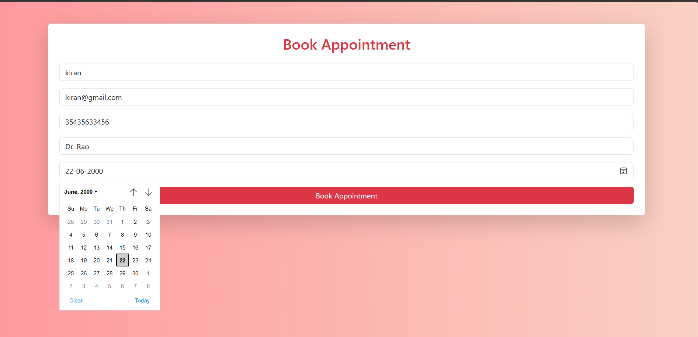
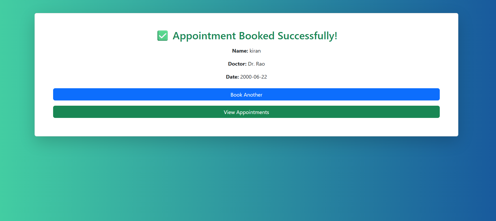
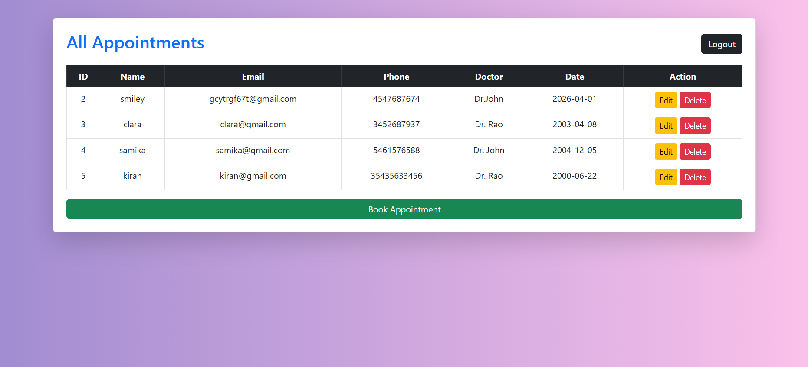

# 🏥 Doctor Appointment System

## 📌 Project Description
The Doctor Appointment System is a web-based application developed to simplify the process of booking and managing doctor appointments. It allows an admin to manage appointments efficiently with full CRUD functionality.

---

## 🚀 Features
- 🔐 Admin Login & Logout (Session-based authentication)
- 📝 Book Appointment
- 📋 View All Appointments
- ✏️ Edit Appointment Details
- ❌ Delete Appointment
- 💻 Responsive UI using Bootstrap

---

## 🛠️ Technologies Used
- **Frontend:** HTML, CSS, Bootstrap  
- **Backend:** PHP  
- **Database:** MySQL  

---

##  How to Run the Project

1. Install XAMPP and start Apache & MySQL  
2. Move the project folder to `C:\xampp\htdocs\`  
3. Open phpMyAdmin and import the database file  
4. Open browser and go to:  
   http://localhost/doctor-appointment-system  

## 📷 Screenshots

### 🔐 Login Page

### 📋 Dashboard

### 📝 Book Appointment

### ✏️ Booked Appointment

### 📝 View Appointment

